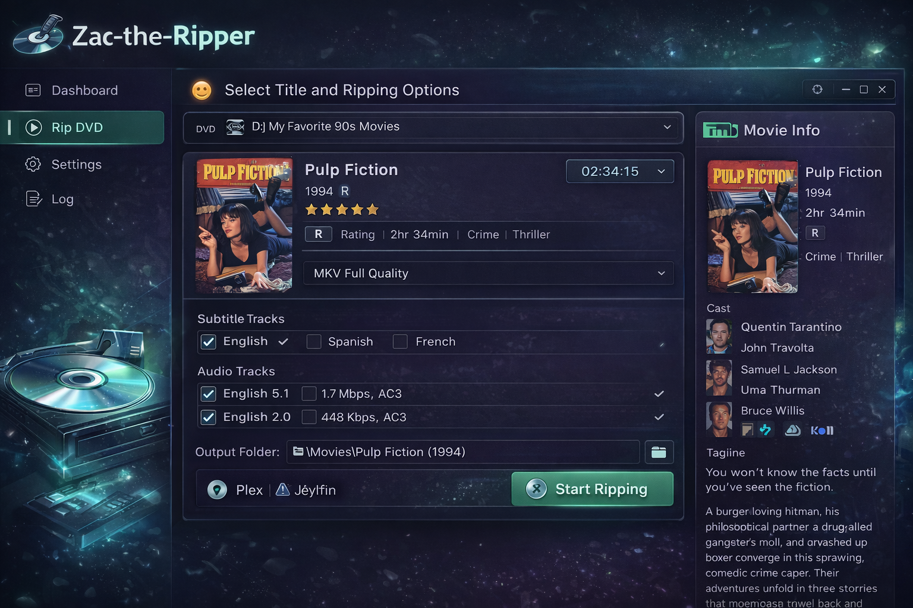

# Zac the Ripper

**A modern desktop app for ripping, encoding, and organizing physical media into your home media library.**




---

## About

Zac the Ripper takes physical DVDs, Blu-rays, and UHD Blu-rays and turns them into organized, encoded files ready for Jellyfin, Plex, or Kodi. It wraps MakeMKV and FFmpeg in a clean UI with automatic disc detection, TMDB metadata lookup, hardware-accelerated encoding, and one-click export to your media libraries.

Built for home media collectors who want a streamlined workflow from disc to library without juggling CLI tools.

## Features

- **Disc ripping** &mdash; DVD, Blu-ray, and UHD Blu-ray extraction via MakeMKV with automatic disc detection
- **MakeMKV deadlock recovery** &mdash; Detects the known v1.18.3 hang bug and automatically falls back to FFmpeg VOB extraction
- **Hardware-accelerated encoding** &mdash; VideoToolbox (macOS), NVENC, QSV, and VAAPI support alongside software x264/x265
- **Three encoding presets** &mdash; H.264 (streaming), HEVC (modern compression), FFV1 (lossless archival)
- **Context-aware encoding** &mdash; Automatic BT.601 &rarr; BT.709 color conversion for DVDs, deinterlacing, HDR passthrough, UHD &rarr; 1080p downscaling
- **Media library export** &mdash; One-click pipeline: rip &rarr; encode &rarr; fetch TMDB metadata &rarr; organize with NFO files and artwork into Jellyfin/Plex/Kodi folder structure
- **Extras handling** &mdash; Featurettes, behind-the-scenes, deleted scenes organized into standard subfolders
- **Multi-disc sets** &mdash; Track and organize box sets across multiple discs
- **Live preview** &mdash; Stream disc content via MPV before ripping
- **Job queue** &mdash; Queue multiple rip and encode jobs with real-time progress, speed metrics, and persistent history
- **Push notifications** &mdash; ntfy.sh integration for job completion/failure alerts
- **Read error tracking** &mdash; Monitors hardware errors during rip and reports damage severity

## Requirements

**Operating system:** macOS (primary), Linux, Windows

**Required tools:**

| Tool | Purpose |
|------|---------|
| [MakeMKV](https://www.makemkv.com/) | Disc decryption and extraction |
| [FFmpeg](https://ffmpeg.org/) | Encoding, VOB fallback ripping, media analysis |

**Optional tools:**

| Tool | Purpose |
|------|---------|
| [lsdvd](https://github.com/JamesHarper/lsdvd) | DVD structure detection (VTS mapping) |
| [mpv](https://mpv.io/) | Disc preview playback |

**Runtime:**
- Node.js 24+ (managed via [asdf](https://asdf-vm.com/) `.tool-versions`)

## Quick Start

```bash
# Clone the repo
git clone https://github.com/Hank-tha-Cowdog/Zac-the-Ripper.git
cd Zac-the-Ripper/v2

# Install dependencies
npm install

# Launch with hot reload
npm run dev

# Production build
npm run build
```

> **Note:** If `better-sqlite3` fails to compile, set `PYTHON=/usr/local/bin/python3` before running `npm install`.

## Architecture

Zac the Ripper follows Electron's main/renderer process split. The main process owns all disc I/O, encoding, and database access. The renderer is a React SPA that communicates exclusively through typed IPC channels.

```
┌──────────────────────────────────────────────────┐
│              Main Process (Node.js)              │
│                                                  │
│  Services          Database        IPC Handlers  │
│  ├─ MakeMKV        ├─ SQLite       ├─ disc       │
│  ├─ FFmpeg          │  (better-     ├─ rip        │
│  ├─ FFmpeg Ripper   │   sqlite3)    ├─ encode     │
│  ├─ FFprobe         ├─ Settings     ├─ jobs       │
│  ├─ Disc Detection  ├─ Jobs         ├─ settings   │
│  ├─ Job Queue       ├─ Discs        ├─ library    │
│  ├─ Kodi Output     ├─ Output Files ├─ tmdb       │
│  ├─ TMDB            └─ Kodi Meta    ├─ preview    │
│  ├─ Notify                          └─ ...        │
│  └─ MPV Player                                   │
└──────────────────────┬───────────────────────────┘
                       │ IPC (preload bridge)
┌──────────────────────┴───────────────────────────┐
│            Renderer Process (React)              │
│                                                  │
│  Pages              Stores          Hooks        │
│  ├─ Dashboard       ├─ AppStore     ├─ useIpc    │
│  ├─ Rip             ├─ JobsStore    ├─ useDisc   │
│  ├─ Progress        ├─ DiscStore    │  Detection │
│  ├─ History         └─ Terminal     ├─ useJob    │
│  ├─ Settings           Store        │  Progress  │
│  └─ Preview                         └─ ...       │
└──────────────────────────────────────────────────┘
```

## Project Structure

```
zac-the-ripper/
├── v2/                          # Active Electron + React app
│   ├── src/
│   │   ├── main/                # Electron main process
│   │   │   ├── main.ts          # Entry point, window creation
│   │   │   ├── preload.ts       # IPC bridge (window.ztr API)
│   │   │   ├── services/        # Core business logic
│   │   │   │   ├── makemkv.ts           # MakeMKV wrapper + deadlock detection
│   │   │   │   ├── ffmpeg-ripper.ts     # FFmpeg VOB fallback extraction
│   │   │   │   ├── ffmpeg.ts            # Encoding with progress
│   │   │   │   ├── ffprobe.ts           # Media analysis
│   │   │   │   ├── disc-detection.ts    # Drive polling + disc info
│   │   │   │   ├── job-queue.ts         # Multi-phase job orchestration
│   │   │   │   ├── kodi-output.ts       # NFO generation + folder structure
│   │   │   │   ├── tmdb.ts             # Metadata + artwork fetching
│   │   │   │   ├── notify.ts           # ntfy.sh + desktop notifications
│   │   │   │   └── mpv-player.ts       # Preview playback
│   │   │   ├── ipc/             # IPC handler modules (12 modules)
│   │   │   ├── database/        # SQLite schema, migrations, queries
│   │   │   ├── encoding-presets/ # FFV1, H.264, HEVC argument builders
│   │   │   └── util/            # Logger, platform helpers
│   │   ├── renderer/            # React frontend
│   │   │   ├── App.tsx          # Router setup
│   │   │   ├── components/
│   │   │   │   ├── layout/      # Shell, sidebar, header, terminal
│   │   │   │   ├── dashboard/   # Active jobs, drive status, stats
│   │   │   │   ├── rip/         # Disc selection, track picker, modes
│   │   │   │   ├── progress/    # Job cards, pipeline view, logs
│   │   │   │   ├── history/     # Job history table + detail modal
│   │   │   │   ├── settings/    # Encoding, paths, library config
│   │   │   │   ├── preview/     # MPV playback controls
│   │   │   │   ├── setup/       # MakeMKV installation wizard
│   │   │   │   └── ui/          # Design system components
│   │   │   ├── stores/          # Zustand state (app, jobs, discs, terminal)
│   │   │   └── hooks/           # IPC wrappers, disc detection, job progress
│   │   └── shared/              # IPC channel constants, app config
│   ├── package.json
│   ├── electron.vite.config.ts
│   ├── electron-builder.yml
│   └── .tool-versions           # Node 24.11.1 (asdf)
├── legacy/                      # Archived v1 scripts
│   └── python-cli/              # Original Python/Tkinter CLI (April 2024)
├── 00_media/                    # Repo assets (screenshots, banners)
└── README.md
```

## Encoding Presets

### H.264 (Streaming)

Best compatibility across devices. Supports hardware acceleration on all major platforms.

| Setting | Software (libx264) | VideoToolbox | NVENC | QSV | VAAPI |
|---------|-------------------|--------------|-------|-----|-------|
| Quality | CRF 18 | q:v 65 | cq 18 | global_quality 18 | qp 18 |
| Preset | slow | - | p7 | - | - |
| Audio | Passthrough | Passthrough | Passthrough | Passthrough | Passthrough |

Smart behaviors:
- SD sources (DVDs): BT.601 &rarr; BT.709 color conversion with PAL/NTSC detection
- Interlaced content: yadif deinterlace before color conversion
- UHD sources: Lanczos downscale to 1080p (software scaler for chroma accuracy)

### HEVC (Modern Compression)

Better compression than H.264 with 10-bit HDR support. Same hardware acceleration options.

- Detects 10-bit/HDR content and uses `main10` profile
- Preserves HDR metadata (color primaries, transfer characteristics, mastering display)
- Software libx265 uses `x265-params` for full HDR metadata passthrough

### FFV1 (Lossless Archival)

Mathematically lossless preservation of the original disc content.

- FFV1 level 3, 24 slices, CRC error detection per slice
- Auto-detects 10-bit content for proper pixel format
- FLAC audio (lossless)
- Every frame is a keyframe for frame-accurate seeking

## Media Library Export

The export pipeline runs as a single job with three phases:

```
Phase 1: Extraction (0-50%)
  ├── MakeMKV rips selected titles to temp staging
  ├── FFmpeg VOB fallback if MakeMKV deadlocks (DVD only)
  └── Concurrent: TMDB metadata + poster/fanart download

Phase 2: Encoding (50-90%)
  ├── FFprobe analyzes source streams
  ├── Main feature encoded (HEVC/H.264)
  └── Extras encoded to library subfolders

Phase 3: Library Organization (90-100%)
  ├── Generate movie.nfo with TMDB metadata
  ├── Copy poster.jpg + fanart.jpg
  ├── Copy to additional libraries (Jellyfin + Plex + Kodi)
  └── Clean up temp staging directory
```

Output folder structure (compatible with Jellyfin, Plex, and Kodi):

```
Movies/
└── Pulp Fiction (1994)/
    ├── Pulp Fiction (1994).mkv
    ├── movie.nfo
    ├── poster.jpg
    ├── fanart.jpg
    ├── Featurettes/
    │   └── Behind the Scenes.mkv
    └── Behind The Scenes/
        └── Making Of.mkv
```

## MakeMKV Fallback System

MakeMKV v1.18.3 has a known deadlock bug where the process hangs after "Using direct disc access mode" with 0% CPU usage. This can occur during both the disc-open phase and mid-rip. Zac the Ripper detects and recovers from this automatically:

1. **Health monitoring** &mdash; Checks CPU usage every 15 seconds via `ps` whenever MakeMKV has been silent for 30+ seconds, regardless of rip phase
2. **Deadlock detection** &mdash; Three consecutive 0% CPU readings (~45 seconds of silence) triggers kill
3. **Stall timeout** &mdash; 5-minute absolute timeout as a safety net
4. **FFmpeg fallback** &mdash; On DVD deadlock, automatically switches to VOB extraction:
   - Detects VIDEO_TS directory and VTS file structure
   - Maps selected titles to their VTS files (via lsdvd or duration heuristic)
   - Concatenates VOB files with FFmpeg concat protocol
   - Own stall detection: 3-minute timeout if FFmpeg stops producing progress (e.g., disc I/O hang)
   - Post-rip validation (stream check + duration tolerance)
5. **Disc polling suppression** &mdash; Drive polling is paused during the entire extraction phase (MakeMKV + FFmpeg fallback) to prevent concurrent disc access conflicts

## Legacy Scripts

The `legacy/python-cli/` directory contains the original v1 Python/Tkinter scripts from April 2024. These are archived for reference and are not actively maintained. The `experimental/` subdirectory has viewer prototypes.

## License

All rights reserved. License TBD.
